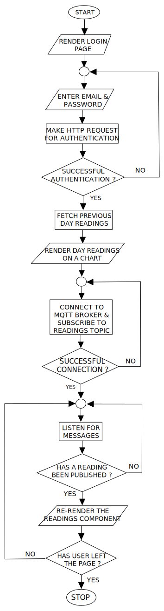

This is the client web application for my final year project

## What it does

- Allow user to login.
- Display temperature and humidity readings from the hatchery in real time.
- Display readings from the past 24 hours.
- Show a toast notification when any reading is outside the ideal limits.

## Flowchart

